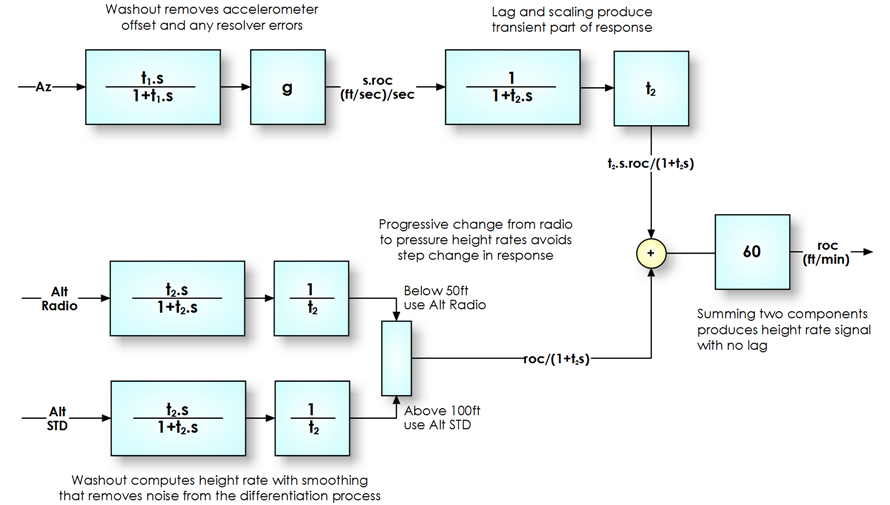
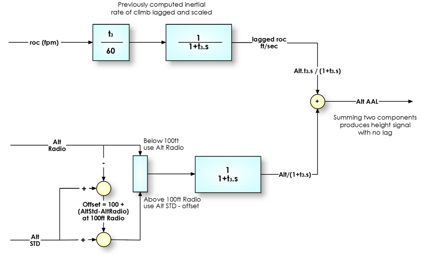

==================
Problem Definition
==================

Aircraft record pressure and radio altitudes, accelerations with respect to the body of the aircraft, and the attitude of the aircraft.

None of these is exactly the information we want for safety analysis, where key parameters are the height with respect to the airfield and in particular the rate of climb or descent.

--------------------------------------
Height, Rate of Climb and Acceleration
--------------------------------------

The relationship we are going to exploit in this section is that these three parameters are related by differentiation, so rate of climb (roc) is the rate of change of altitude, and the vertical acceleration is the rate of change of roc::

    roc(ft/sec) = s.h(ft)

and::

    acceleration(ft/sec/sec) = s.roc(ft/sec)

OK, we normally express rate oc climb in ft/min and acceleration is often in g, but these are just scaling constants that we can sort out as we go along.

---------------------
Altitude Measurements
---------------------

We have two measurements of altitude, namely pressure altitude "Altitude STD" and radio, "Altitude Radio" to use the POLARIS naming convention. The objective is to calculate a height with respect to the airfield that has the best characteristics of both.

Let's look at the errors for which we are trying to compensate:

**Radio Altitude**

The radio altitude works well over a flat surface but as soon as we are off the runway surface the effect of ground profile starts to alter the readings. While this is correct for the height above the surface we don't want this included in our Altitude Above Airfield Level, "Altitdue AAL" calculation.

**Pressure Altitude**

The pressure altitude works well in flight, but suffers from transient pressure fluctuations around the airframe at the point of takeoff or landing. These result in apparent dips below the runway elevation at the point of rotation.

--------------------------
Resolution of Acceleration
--------------------------

The acceleration data we have is measured with respect to the body of the aircraft, so the first step is to resolve the three body accelerations to compute the vertical acceleration (perpendicular to the earth surface).

The resulting Acceleration Vertical is scaled in g, and retains the 1.0 datum and positive upwards. The code looks like this::
    
    pitch_rad = np.radians(pitch.array)
    roll_rad = np.radians(roll.array)
    resolved_in_roll = acc_norm.array*np.ma.cos(roll_rad) - acc_lat.array * np.ma.sin(roll_rad)
    self.array = resolved_in_roll * np.ma.cos(pitch_rad) + acc_long.array * np.ma.sin(pitch_rad)

---------------------
Correction for errors
---------------------

The acceleration term will include errors due to (a) the three accelerometers measurement errors, (b) errors in the pitch and roll attitude measurements, (c) numerical errors in the computation and (d) variation in the earth's gravitational field. If we do not compensate for these, there will be a large error in the result. The "washout" filter is therefore used to - you guessed it - wash out any errors in the signal. The time taken for removing these errors can be long, as they tend to be constant and we are interested in the transient response from the accelerometer.::
    
    # Resolved vertical acceleration washout time constant. This long period
    # function removes any standing offset to the resolved acceleration signal
    # and is essential in the vertical velocity complementary filter.
    AZ_WASHOUT_TC = 60.0

Once the errors have been removed, we need to scale the data into the correct units and as we are working in height units of feet, the scaling factor is 32.2 ft/sec/sec.

=====================
Complementary Filters
=====================

The problem that the height and height rate algorithms need to solve is how to merge a collection of imperfect parameters to obtain the optimal solution, without introducing additional artefacts.

There are a number of possible mathematical solutions, the two most suitable being Kalman filtering and complementary filtering. While Kalman filtering is popular among mathematicians, it has a drawback that it is a very opaque technique and when it goes wrong it is dificult to understand the cause of the problem. For this reason we have selected a simpler complementary filter algorithm.

**A little bit of maths**

For non-mathematicians, please accept that the letter "s" means to calculate the rate of change of something, so "s.heading" is the rate of change of heading.

The inverse of this process, 1/s, corresponds to a summation process, so by adding together all the rate of climb values over a period will tell you the height of the aircraft.

For mathematicians, we are using the Laplace transform. 'nuff said.

**How engineers use the maths**

Now, pure integration leads to errors because any errors get bigger and bigger over time, as the error gets added repeatedly. Therefore we avoid pure integration and perform a process with a function 1/(s+1). Over short periods, it performs like an integrator 1/s, but in long periods it behaves like a simple 1:1 connection. Its nickname the "leaky integrator" describes it well.

Similarly, pure differentiation is not an ideal process as it introduces lots of noise in a signal, and so the transient calculation s/(s+1) is used. Again this has the required short term characteristic of a differentiator, s, and its long term transfer function is nil. Again, the nickname "washout" describes the function well, with short term data passing directly, and long term values washing out to zero.

Why focus on these two elements? Simply that by adding s/(s+1) to 1/(s+1) we obtain (s+1)/(s+1) = 1. That is, the two complementary parts can be added together to yield exactly the result we are looking for.

===============================
Rate Of Climb (roc) Calculation
===============================

Complementary first order filters are used to combine the transient roc component, derived from acceleration, with the long term rate of change of height obtained from a washout function. This signal flow diagram explains the sequence, and will help you follow the discussion that follows.

The vertical acceleration signal which has been prepared by removing errors and scaling is first lagged to produce a term which has the transfer function t2/(1+t2s).

With two alternative sources of height information we can differentiate either to give two alternative sources of rate of climb. The two don't have an immediate point of equivalence, but we want to convert from the radio signal to the pressure signal after the aircraft leaves ground effect and before it flies away from the plane of the runway. The solution is to merge progressively from one to the other between 50ft and 100ft Radio. By merging the altitude rate signals, we avoid problems of pressure altimeter datums. For this reason we can use Altitude STD without having to make any correction for the pressure of the day.::
    
    std_rad_ratio = np.maximum(np.minimum((alt_rad_repair-50.0)/50.0,1),0)
    roc_altitude = roc_alt_std*std_rad_ratio + roc_alt_rad*(1.0-std_rad_ratio)

Combination is then trivial, as we just add the two components::
    
    sum = h.t2.s/(t2.(1+t2.s)) + acc.t2/(1+t2.s)

but::

    h.s = roc

and::

    acc = roc.s

so by cancelling the t2 terms in the first part of the equation and replacing h.s and acc this becomes::

    sum = roc/(1+t2.s) + roc.t2/(1+t2.s)
    sum = roc(1+t2.s)/(1+t2.s)
    sum = roc

The units of this are ft/sec, so we need to multiply by 60 to give the conventional ft/min units used in aviation.

If you have persevered this far, you can see that our summation has produced a rate of climb signal that has no offsets, the transient response of the accelerometers, the long term accuracy of the pressure altimeter and precision of the radio altimeter at the point of takeoff or landing. Further, the POLARIS framework results in the calculation being run at the highest source data frequency of 8Hz with all lower sample rate parameters being interpolated and aligned maintain correct sample timing.

========================
Altitude AAL Calculation
========================

This is the main altitude measure used during analysis. Again, a picture will help the reader follow the explanation which is similar to, but simpler than, the rate of climb calculation.

Where radio altimeter data is available, this is used for altitudes up to 100ft and thereafter the pressure altitude signal is used. The two are "joined" together at the sample above 100ft in the climb or descent as appropriate. 

Once joined, the altitude signal is inertially smoothed to provide accurate short term signals at the sample rate of the Rate of Climb parameter, and this also reduces any "join" effect at the signal transition.

The rate of climb signal is scaled by 1/60 to reverse the change above, then terms are similar to those in the rate of climb calculation::
    
    sum = roc.t3/(t3.s+1) + h/(t3.s+1)

replacing h.s as before we have::

    sum = h.t3.s/(t3.s+1) + h/(t3.s+1)
    sum = h(t3.s+1)/(t3.s+1)
    sum = h

This Altitude AAL signal is based upon the takeoff or landing airfields, has the characteristics of the radio altimeter below 100ft and pressure altimetry above this altitude, but the noise and poor resolution of the recorded altimeter signals is replaced by inertial, high sample rate, data. 